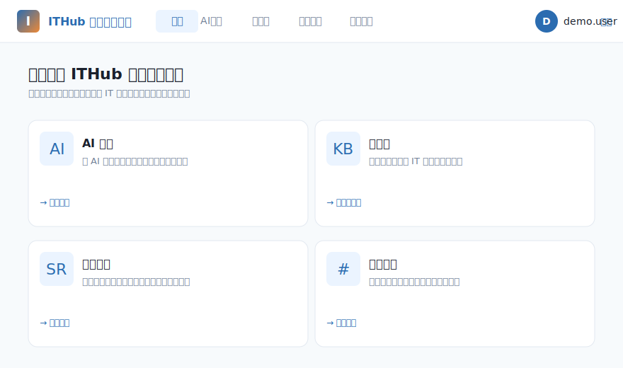
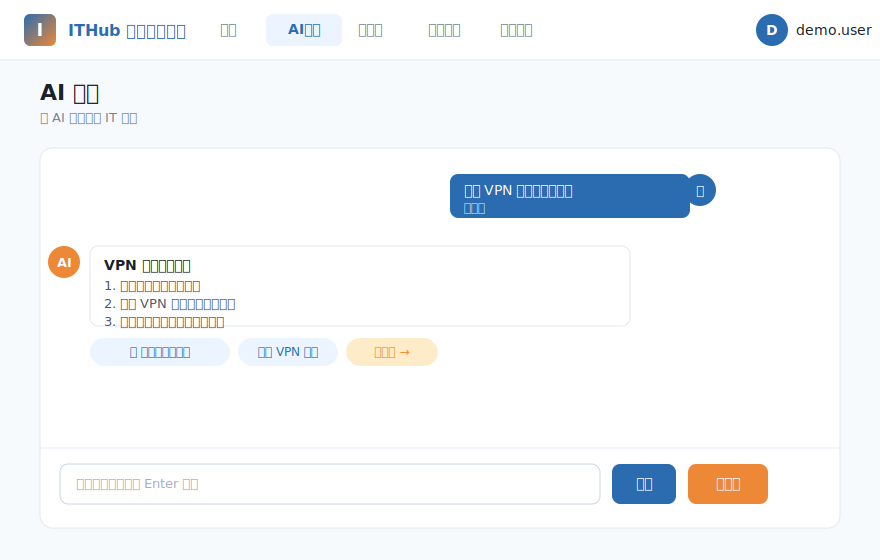
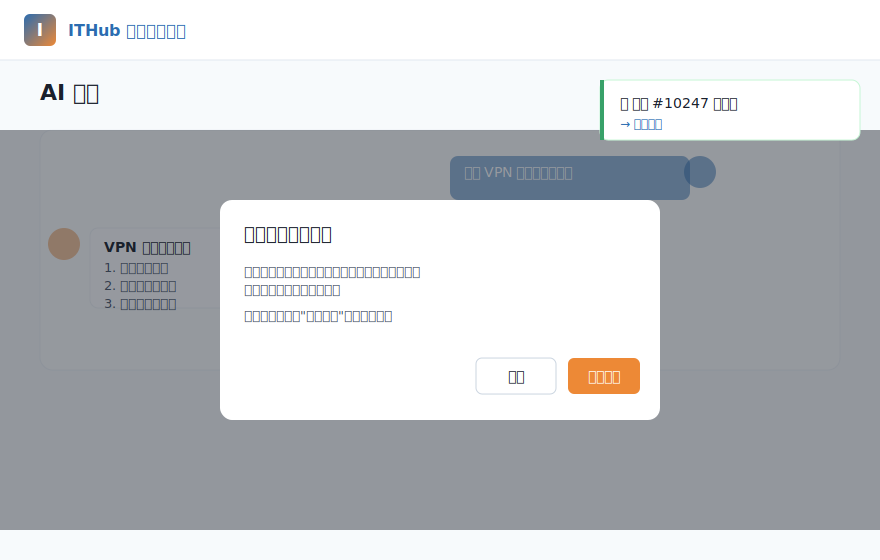
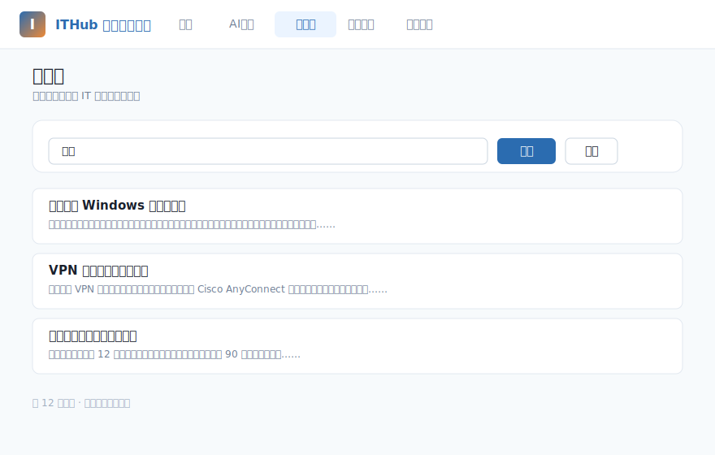
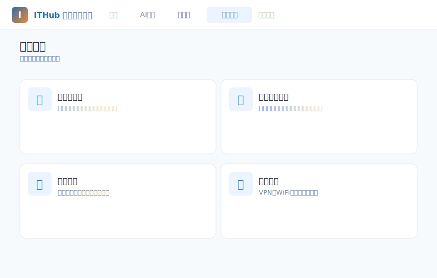
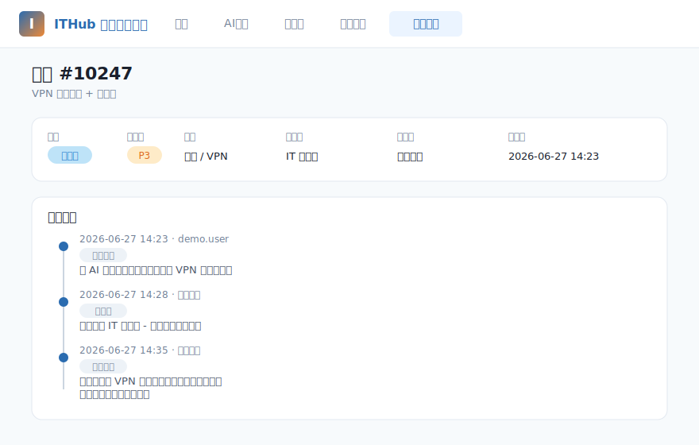

# ITHub 智能服务门户 Demo

一个面向终端用户的自助服务IT帮助门户Demo。基于 ITHub REST API 构建，提供完整的用户视角闭环体验：

1. 登录门户
2. 与 AI 助手对话（KB 知识库加持）
3. 未解决时一键"转人工" → 自动开单
4. 在"我的工单"中查看进度、补充备注
5. 浏览知识库、服务目录，提交服务请求

## 预览

### 首页



### AI 助手 — 对话 + 一键转人工

| 聊天界面 | 转人工确认 |
|---|---|
|  |  |

### 知识库 / 服务目录 / 我的工单

| 知识库搜索 | 服务目录 | 工单详情 + 时间线 |
|---|---|---|
|  |  |  |

> 截图替换说明：将真实的截图放在 `docs/preview-*.png`（或 `.jpg`），文件名保持一致即可，无需改 README。

## 架构

```
React (web/)  ──HTTP──►  Express (server/)  ──HTTP + AccessToken──►  ITHub API
   Vite dev proxy :5173 → :4000             demo.logicalisservice.com/api
```

后端作为代理的核心目的：把 `AccessToken` 隐藏在服务端，浏览器永远拿不到；统一处理 CORS；统一错误归一化为中文提示。

## 快速启动

```bash
# 1. 安装依赖
npm install
(cd server && npm install)
(cd web && npm install)

# 2. 配置 .env
cp server/.env.example server/.env
# 编辑 server/.env，填入 ITHUB_DEMO_IDENTITY / ITHUB_DEMO_PASSWORD
cp web/.env.example web/.env

# 3. 启动前后端
npm run dev
# 后端 :4000  前端 :5173
```

打开 http://localhost:5173

## 演示脚本（5分钟）

1. 登录页 → 点登录（凭证已在 .env 预填）
2. 首页 → 点 "AI助手"
3. 输入 "我的VPN连不上" → 看 AI 回复 + 建议操作
4. 点 "转人工" → 确认 → 看 toast + 工单创建
5. 点 "查看工单" → 看时间线、加备注
6. 切换到 "知识库" / "服务目录" 演示完整闭环
7. 退出登录

## 切换租户

只需改 `server/.env`：
- `ITHUB_CUSTOMER_TAG` — 客户标签
- `ITHUB_DEMO_IDENTITY` / `ITHUB_DEMO_PASSWORD` — 演示账号
- `AI_PROFILE_ID` / `KB_ID` — 可选，启动时会自动发现

## 目录

- `server/` — Express 后端代理
- `web/` — React + Vite 前端
- `docs/` — 截图 / 预览 SVG（待真实截图替换）
- 详细计划见 `/Users/leo.chen/.claude/plans/demo-it-valiant-aho.md`